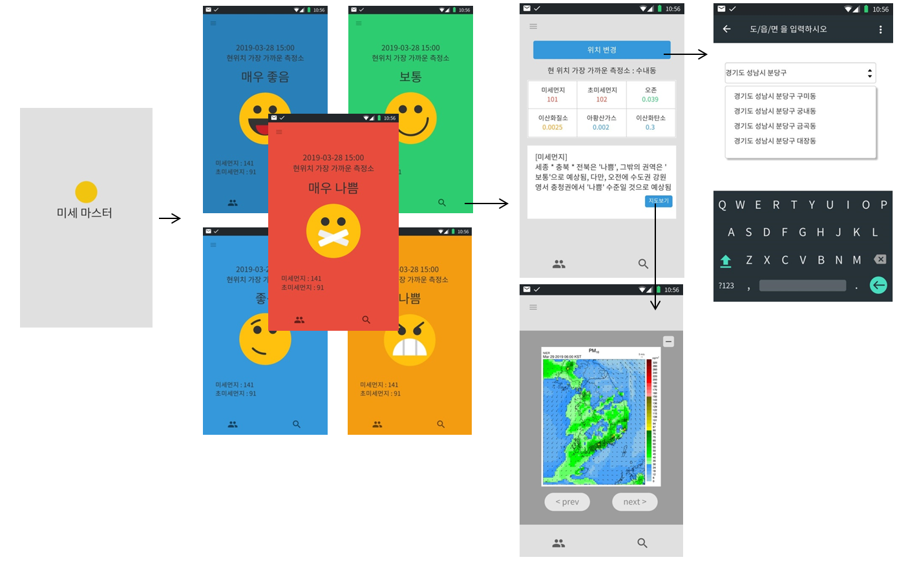

# DustApp
 : React Native Dust App
 * 2019년 1월 ~ 2월 개발 
  실시간 미세먼지 정보를 가져와 보여줍니다.
 
# DustApp 필요성 
- 2018년도부터 중국으로부터 들어온 미세먼지로 인해 실시간 데이터 확인 요구가 증가
- 미세먼지, 공기질을 한눈에 볼 수 있는 간결한 조작체제(UI)로 누구나 편하게 사용

# DustApp 특징 및 기능 
 - 매시간 마다 데이터를 업데이트 하여 보여주는 형식으로 개발
 - 미세먼지의 양에 따라 WHO에서 제공하는 기준으로 공기질 판단
 - 미세먼지 양을 효율적으로 보여주는 UI 
 - 미세먼지 관련 뉴스 화면 UI

# DustApp 사용언어
```dart
 React Native(Expo), JavaScript
```

# Server
```
 Nodejs Express (Rest API)
```

# 와이어 프레임

<p align="center">
 	
</p>

* https://ovenapp.io/view/iQKSY9gtcLS3qfOIlBdviWxsIGh6JPHl/NHx0W 
